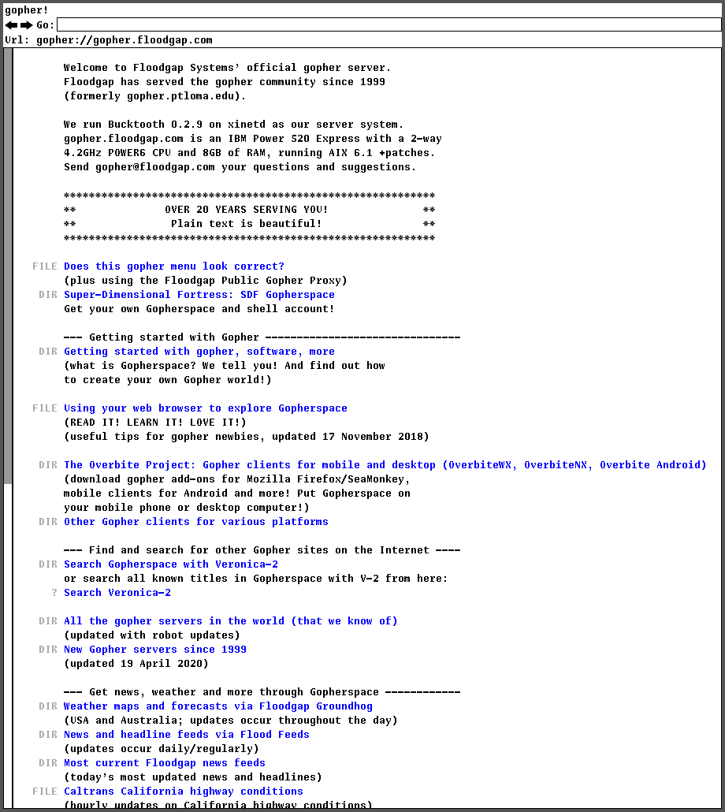

gopher
=======
A mostly functional gopher browser for plan9.

Most gopher item types are handled:
- Text and submenu items are displayed within the browser
- Images and documents are opened through page(1)
- HTML items are sent to the plumber(4)
- Binary items (bin, dos, uuencoded files and sound) are downloaded to disk
- Other types are not handled (e.g. telnet)

Following keyboard shortcuts are available:
- b: previous page in history
- n: next page in history
- q: quit

This has not been thoroughly tested so many bugs are just waiting to be found.

Usage:
------
Install with ``mk install``  
Run with ``gopher [address]``

